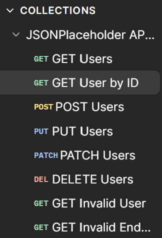
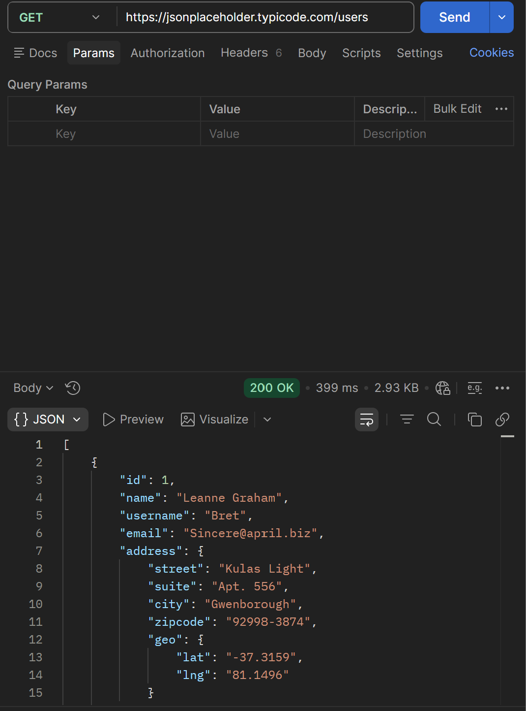
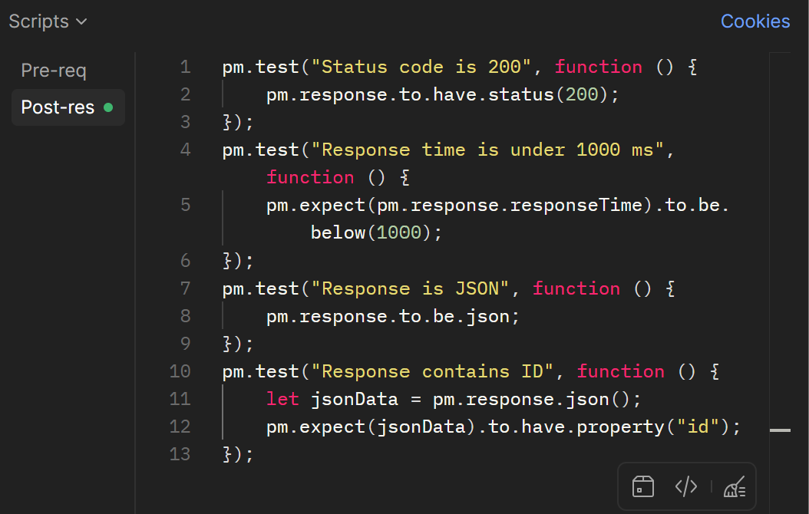

# API Testing with Postman

## Overview

This project demonstrates practical REST API testing using Postman. It includes CRUD operations, response validation, positive and negative testing, and basic automated Postman tests using JavaScript.

The project uses the **JSONPlaceholder** public REST API as the testing environment.

---

## Skills Demonstrated

- REST API Testing
- HTTP Methods (GET, POST, PUT, PATCH, DELETE)
- CRUD Operations
- Response Validation
- Status Code Verification
- JSON Response Analysis
- Positive & Negative Testing
- API Error Handling
- Postman Collections
- Automated Postman Test Scripts
- QA Test Case Design

---

## Test Scenarios

### Positive Testing

- Retrieve all users
- Retrieve a specific user by ID
- Create a new user
- Update an existing user (PUT)
- Partially update a user (PATCH)
- Delete a user

### Negative Testing

- Invalid endpoint
- Invalid resource ID

---

## Automated Tests

The Postman Collection includes automated validation for:

- Status code verification
- Response time validation
- JSON response validation
- Required field validation

---

## Tools Used

- Postman
- JSONPlaceholder REST API
- JavaScript (Postman Tests)

---

## Repository Contents

- Exported Postman Collection
- Project Documentation (README)
- Project Screenshots

---

## Screenshots

### Postman Collection

### GET User by ID

Shows a successful API request returning a **200 OK** response with a valid JSON object.

### Automated Postman Tests

Demonstrates automated validation of:

- Status code
- Response time
- JSON format
- Required response fields

---

## Learning Outcomes

Through this project, I gained practical experience in:

- Designing and executing API test cases
- Validating API responses
- Testing REST endpoints using Postman
- Writing basic automated Postman tests
- Organising API collections for QA workflows
- Applying positive and negative testing techniques

---

## Future Improvements

Future enhancements may include:

- Collection Runner execution
- Environment variables
- Authentication testing
- Newman CLI integration
- CI/CD pipeline integration

---

This project was completed as part of my **Software Engineering (QA) Internship** and personal portfolio development.
